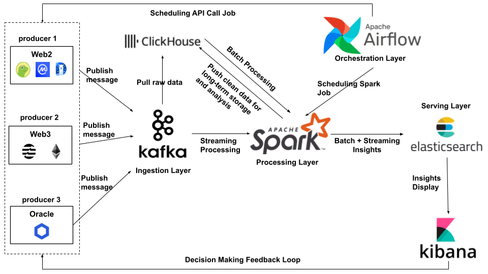

# Crypto Market Analysis System

## General Information
This project is a large assignment for a big data processing and storage course. It addresses the challenge of blockchain data, characterized by the '3Vs' of Big Data:
* **Volume**: Managing massive amounts of historical and real-time transactions.
* **Velocity**: Handling the high-speed generation of blocks and event logs.
* **Variety**: Parsing heterogeneous data types, including raw transactions, internal smart contract calls, and complex metadata.

Despite its transparency and immutability, this on-chain data is often "dirty" and contains many unnecessary data fields for specific analysis. 
Therefore, the project focuses on collecting, cleaning, and processing this complex data using modern big data technologies.

## System Overview



## Setup

1. Clone the repository:
```bash
git clone <repository-url>
cd crypto-market-analysis-system
```

2. Create environment configuration:
```bash
cp .env.example .env
```

3. Configure RPC providers in `.env`:

Open `.env` and set at least 3 Ethereum RPC provider URLs for optimal performance:
```env
RPC_PROVIDER_URIS=https://eth-mainnet.g.alchemy.com/v2/YOUR_KEY_1,https://eth-mainnet.g.alchemy.com/v2/YOUR_KEY_2,https://mainnet.infura.io/v3/YOUR_KEY_3
```

Note: The system uses one worker per RPC provider for maximum throughput. Free-tier providers like Alchemy and Infura are recommended.

4. Create Docker network:
```bash
docker network create crypto-net
```

5. Start required infrastructure:

Ensure your Kafka cluster and ClickHouse cluster are running before proceeding to usage.

## Full Pipeline Integration (How to run everything)

To run the complete Real-time Analytics Pipeline (Kafka -> Spark -> Elastic -> Kibana), follow this execution order:

### 1. Start Infrastructure Layer
Navigate to each directory and start the services. Order matters!

```bash
# From the project root directory
# 1. Start Kafka Cluster (Message Bus)
cd infrastructure/kafka-cluster && docker compose -f docker-compose-kafka.yml up -d
./scripts/create-topic.sh coingecko.eth.coins.market.v0 # Create Topic for Market Data

# 2. Start Elastic Cluster (Storage & Viz)
cd ../elastic-cluster && docker compose -f docker-compose-elastic.yml up -d

# 3. Start Spark Cluster (Processing Engine)
# Note: Ensure you have built the image first if changed (docker compose build)
cd ../spark-cluster && docker compose -f docker-compose-spark.yml up -d

# 4. Start Airflow Cluster (Orchestration)
cd ../airflow-cluster && docker compose -f docker-compose-airflow.yml up -d
```

### 2. Initialize System & Run Pipeline (Via Airflow)
Once all containers are up and healthy (check with `docker ps`), you can manage the pipeline via the Airflow UI.

1. **Access Airflow UI:** Go to `http://localhost:8080` (Credentials: `admin`/`admin`).
2. **Unpause and Trigger DAGs:**

   *   **Step A: Initialize Elasticsearch Indices (One-time setup)**
       *   The `init_indices.py` script needs to be run once to set up Elasticsearch mappings.
       *   **Option 1 (Recommended for initial setup):** Run manually from Airflow's environment:
           ```bash
           docker exec airflow-webserver python /opt/airflow/project/storage/elasticsearch/init_indices.py
           ```
       *   **Option 2 (Advanced/Production):** Create a dedicated Airflow DAG to run this script.

   *   **Step B: Start Spark Streaming Job**
       *   Find the DAG named `processing_spark_streaming_market_prices`.
       *   Unpause it (toggle the switch) and **Trigger** it manually once.
       *   This submits the long-running Spark job to the cluster. Check Spark Master UI (`localhost:9090`) to see it running.

   *   **Step C: Start Data Ingestion (Periodic)**
       *   Find the DAG named `ingestion_coingecko_market_data`.
       *   Unpause it. This DAG is scheduled to run every 5 minutes to fetch new market data and push it to Kafka.

### 3. Verify Data Flow
1. **Check Kafka:** You can use Kafka UI (`http://localhost:8889`) to see messages flowing into `coingecko.eth.coins.market.v0`.
2. **Visualize in Kibana:** 
   *   Open Kibana at `http://localhost:5601`.
   *   Go to **Stack Management > Data Views**.
   *   Create a Data View for `crypto_market_prices*`.
   *   Go to **Discover** or **Dashboard** to see real-time market data appearing.

## Development & Debugging
For manual execution, testing individual components, or in-depth debugging outside of Airflow's orchestration, please refer to the dedicated [Developer Guide](docs/developer_guide.md).


## Usage

The streaming CLI allows extraction of various entity types from the Ethereum blockchain.

### 1. Start Streaming from the Latest Block (Real-time Data)

This mode continuously ingests near real-time data starting from the current latest block.

Note: If `last_synced_block.txt` exists, the streamer will resume from the block recorded in that file. To start fresh from the current latest block, delete the file first:
```bash
rm -f last_synced_block.txt
```

Command:
```bash
python3 run.py stream_ethereum \
    --output kafka/localhost:9092,localhost:9093,localhost:9094 \
    --entity-types block,receipt,transaction,token_transfer,contract \
    --lag 4 \
    --batch-request-size 3 \
    --block-batch-size 100 \
    --num-worker-process 3 \
    --rate-sleep 2.0 \
    --chunk-size 50 \
    --queue-size 5 \
    --topic-prefix crypto.raw.eth.
```

### 2. Start Streaming from a Specific Historical Block

This mode is used for backfilling historical data.

Determine block range for a specific date:
```bash
python3 run.py get_eth_block_range_by_date --date 2023-12-01
```
This outputs start and end block numbers (e.g., `18690000,18697100`).

Important: Delete `last_synced_block.txt` before running with `--start-block`:
```bash
rm -f last_synced_block.txt
```

Command:
```bash
python3 run.py stream_ethereum \
    --start-block 18690000 \
    --end-block 18692000 \
    --output kafka/localhost:9092,localhost:9093,localhost:9094 \
    --entity-types block,receipt,transaction,token_transfer,contract \
    --lag 4 \
    --batch-request-size 2 \
    --block-batch-size 100 \
    --num-worker-process 3 \
    --rate-sleep 2.0 \
    --chunk-size 50 \
    --queue-size 5 \
    --topic-prefix crypto.raw.eth.
```

CLI Parameters:
- `--provider-uris`: (Optional) RPC provider URIs. Defaults to values in `.env`
- `--output`: Output destination. Defaults to Kafka
- `--lag`: Number of blocks to lag behind the latest block. Defaults to 0
- `--batch-request-size`: Blocks per RPC batch request
- `--block-batch-size`: Blocks processed per sync cycle
- `--num-worker-process`: Number of parallel workers
- `--rate-sleep`: Sleep time between requests (seconds)
- `--chunk-size`: Number of blocks per worker task chunk
- `--queue-size`: Internal queue size for backpressure
- `--topic-prefix`: Kafka topic prefix
- `--start-block`: Specifies the exact block number to start syncing from
- `--end-block`: Block number to stop syncing at

### 3. Get Eth market data

```bash
python3 run.py get_eth_market_data
```

### 4. Get Historical Data
```bash
python3 run.py get_eth_historical_token_data --days 1
```

### 5. Get Latest Prices
```bash
python3 run.py get_eth_latest_token_price
```


## References.
* https://github.com/blockchain-etl/ethereum-etl
* https://github.com/ethereum/EIPs?tab=readme-ov-file


## Contact
Created by [@cuongct220020]