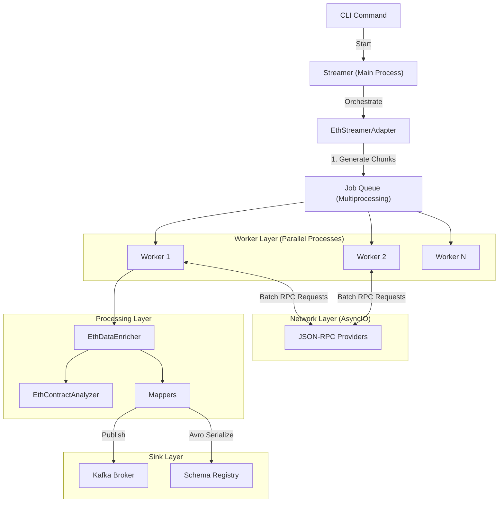

# Ethereum Data Ingestion Pipeline

## 1. Architecture Overview

Hệ thống được thiết kế theo kiến trúc **High-Performance Asynchronous Streaming**, tối ưu hóa cho việc ingestion lượng lớn dữ liệu blockchain trong thời gian thực.

**Key Technologies:**
*   **Python Multiprocessing:** Vượt qua giới hạn GIL để tận dụng đa nhân CPU.
*   **AsyncIO & uvloop:** Tăng tốc độ I/O (Network requests) lên gấp nhiều lần so với luồng đồng bộ.
*   **Kafka & Avro:** Streaming data backbone với schema validation chặt chẽ.

### Data Flow Diagram

## 2. Pipeline Stages

### 2.1. Orchestration (Main Process)
*   **Component:** `Streamer` & `EthStreamerAdapter`
*   **Role:**
    *   Quản lý `last_synced_block`.
    *   Chia nhỏ dải block (ví dụ 1M blocks) thành các `chunks` nhỏ (ví dụ 10 blocks) để cân bằng tải.
    *   Khởi tạo pool các `IngestionWorker`.

### 2.2. Ingestion (Worker Process)
Mỗi Worker hoạt động độc lập với một Event Loop riêng (`uvloop`), thực hiện chu trình:

1.  **Fetching (Network Bound):**
    *   Sử dụng `RpcClient` với `aiohttp` Session bền vững (persistent connection).
    *   Gửi **Batch Requests** để giảm RTT (Round Trip Time).
2.  **Enrichment (CPU Bound):**
    *   Parse JSON response.
    *   Kết hợp dữ liệu từ `Block` và `Receipts` để làm giàu thông tin Transaction (Gas used, Status, Logs).
    *   **Token Transfers Parsing:**
        *   Duyệt `json_logs`, kiểm tra `event_transfer_signature` và độ dài `topics`.
        *   Nếu khớp pattern: Gán `contract.is_erc20/721/1155 = true` dựa trên signature khớp.
        *   **Mint/Burn Logic:** Check `from` == `ZERO_ADDRESS` (Mint) hoặc `to` == `ZERO_ADDRESS` (Burn).
3.  **Smart Contract Processing:**
    *   Tự động phát hiện địa chỉ Contract mới từ `Receipt` (trường `contractAddress`) và `Logs` (trường `address`).
    *   Đẩy vào hàng đợi xử lý chung để phân loại (Proxy, Standard, v.v.).
4.  **Exporting:**
    *   Serialize dữ liệu thành Avro binary.
    *   Đẩy xuống Kafka topic tương ứng.

### 2.3. Smart Contract Analysis Strategy (Chi tiết Logic)

Quy trình phân tích Contract được thực hiện nghiêm ngặt để xác định Proxy Pattern và Implementation:

#### A. Initial Check & Metadata
1.  **Collection:** Lọc `contract_address` từ `receipts` và `address` từ `logs`, đẩy vào cache chung.
2.  **Bytecode Check:** Với mỗi address, gọi `eth_getCode`. Nếu không có code -> EOA (Bỏ qua vì chưa hỗ trợ model ví người dùng).
3.  **Standard Metadata:** Với contract đã identify là ERC20/721 (qua logs):
    *   Gọi `eth_call` lấy `name`, `symbol`, `decimals`, `total_supply` (ERC20) hoặc `name`, `symbol` (ERC721).

#### B. Proxy Detection Logic
Quy trình xác định Proxy đi theo các bước ưu tiên từ tất định (Deterministic) đến xác suất (Probabilistic):

1.  **Minimal Proxy (EIP-1167):**
    *   **Logic:** So sánh bytecode runtime hex với pattern chuẩn: `363d3d373d3d3d363d73...5af43d82803e903d91602b57fd5bf3`.
    *   **Kết quả:** 100% chính xác. Lấy 20 bytes ở giữa làm `implementation_address`.

2.  **Transparent Proxy (EIP-1967):**
    *   **Logic:** Đọc Storage Slot `EIP1967_IMPL` (`0x360894a13ba1a3210667c828492db98dca3e2076cc3735a920a3ca505d382bbc`).
    *   **Kết quả:** Nếu có dữ liệu khác 0 -> Transparent Proxy. Lấy address từ slot.
    *   *Kiểm tra phụ:* Bytecode có chứa function selector `upgradeTo(address)` (`0x3659cfe6`) hoặc `upgradeToAndCall` (`0x4f1ef286`).

3.  **UUPS Proxy (Universal Upgradeable Proxy Standard):**
    *   **Logic:** Nếu không phải Transparent, kiểm tra bytecode có chứa pattern của hàm `upgradeTo`.
    *   **Kết quả:** Nếu có -> UUPS Proxy.
    *   Tiếp tục phân tích tĩnh để lấy function sighashes.

4.  **Beacon Proxy:**
    *   **Logic:** Đọc Storage Slot `EIP1967_BEACON` (`0xa3f0ad74e5423aebfd80d3ef4346578335a9a72aeaee59ff6cb3582b35133d50`).
    *   **Kết quả:** Nếu có dữ liệu -> Beacon Proxy.

5.  **Other Patterns:**
    *   Phân tích Function Selectors cho **Diamond Proxy**, **Gnosis Safe**, v.v. dựa trên các selectors đặc trưng trong bytecode.

#### C. Implementation Analysis
*   Với mọi `implementation_address` tìm được, hệ thống tiếp tục gọi `eth_getCode(imple_address)`.
*   Thực hiện **Static Analysis & Disassembly** để lấy danh sách `function_sighashes`.
*   Phân loại Category cuối cùng dựa trên Implementation Bytecode.

## 3. JSON-RPC Strategy

Để tối ưu hóa chi phí (Compute Units) và tốc độ, hệ thống sử dụng tập hợp các phương thức RPC chọn lọc:

### Core Methods

| Method | Mục đích | Tại sao dùng? |
| :--- | :--- | :--- |
| **`eth_getBlockByNumber`** | Lấy thông tin Header của Block và danh sách Transactions đầy đủ. | Tham số `full_transactions=True` giúp lấy toàn bộ Tx trong 1 call, tránh gọi N lần `eth_getTransactionByHash`. |
| **`eth_getBlockReceipts`** | Lấy toàn bộ Receipts của một Block. | **QUAN TRỌNG:** Đây là phương thức mở rộng (non-standard nhưng phổ biến ở Alchemy/QuickNode/Infura). Nó thay thế cho việc gọi hàng nghìn `eth_getTransactionReceipt`. Giúp giảm request từ `O(N)` xuống `O(1)`. |
| **`eth_getCode`** | Lấy Bytecode của Smart Contract. | Để phân tích xem contract đó làm gì (ERC20/721/Proxy). |
| **`eth_call`** | Gọi hàm `view` của contract (name, symbol...). | Dùng để lấy metadata on-chain mà không tốn gas. |
| **`eth_getStorageAt`** | Đọc giá trị tại Storage Slot. | Dùng để kiểm tra EIP-1967 slots (Implementation, Admin, Beacon) xác định Proxy. |

### Optimization Techniques
*   **Batching:** Gộp nhiều call (`eth_getBlockByNumber` cho block 1000, 1001, 1002...) vào một HTTP Request duy nhất.
*   **Failover:** Tự động chuyển sang Provider khác nếu một node bị lỗi hoặc Rate Limit (429).

## 4. Provider Comparison & Selection

Việc chọn Provider ảnh hưởng trực tiếp đến chiến lược Ingestion (đặc biệt là hỗ trợ `eth_getBlockReceipts`).

| Tiêu chí | Infura (Free) | QuickNode (Free) | Alchemy (Free) | Kiến nghị |
| :--- | :--- | :--- | :--- | :--- |
| **Hỗ trợ `eth_getBlockReceipts`** | Không (Standard only) | Có (Add-on) | **Có (Native)** | Alchemy thắng tuyệt đối ở khoản này cho Ingestion. |
| **Giới hạn** | 100k reqs/day | 10M Credits | 300M CUs/month | Alchemy hào phóng nhất cho dev. |
| **Rate Limit** | Thấp (~3 RPS) | Trung bình | Cao (~30 RPS) | |
| **Batching Support** | Tốt | Tốt | Tốt | |

**Kết luận:** Với pipeline hiện tại, **Alchemy** là lựa chọn tối ưu nhất nhờ hỗ trợ native `eth_getBlockReceipts` và hạn ngạch miễn phí lớn.