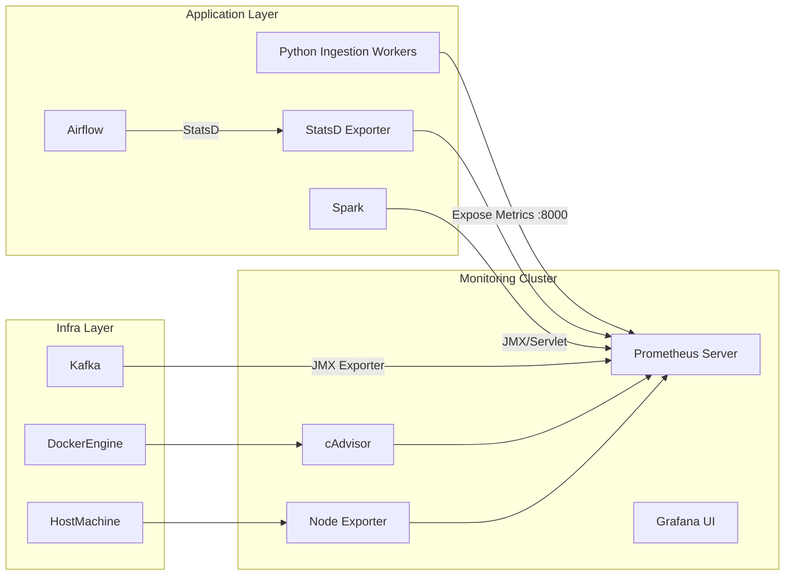

# Giám sát hệ thống với Prometheus & Grafana

## 1. Phân tích hiện trạng và Nhu cầu

### 1.1. Hiện trạng hệ thống
Dựa trên kiến trúc được mô tả trong `ethereum_ingestion_pipeline_report.md` và cấu trúc dự án:
- **Ingestion:** Sử dụng Python `multiprocessing` để xử lý song song. Việc giám sát hiện tại chủ yếu dựa vào logs.
- **Queue:** Apache Kafka đóng vai trò xương sống.
- **Processing:** Spark (Streaming & Batch) và ClickHouse.
- **Orchestration:** Airflow.

### 1.2. Điểm mù (Blind Spots)
Hiện tại hệ thống thiếu các metric thời gian thực để trả lời các câu hỏi:
- Tốc độ ingestion (Blocks/s, Transactions/s) thực tế là bao nhiêu?
- Tỷ lệ lỗi RPC (429 Rate Limit, 5xx Errors) từ Alchemy/Infura là bao nhiêu?
- Độ trễ (Lag) giữa block mới nhất trên chain và block đã ingest vào Kafka?
- Spark Streaming có đuổi kịp tốc độ đẩy tin của Kafka không (Consumer Lag)?

## 2. Kiến trúc Giám sát Đề xuất

Chúng ta sẽ tích hợp bộ đôi tiêu chuẩn **Prometheus (Thu thập)** và **Grafana (Hiển thị)**.



## 3. Hướng dẫn Tích hợp Chi tiết

### 3.1. Cập nhật Hạ tầng (`infrastructure/monitoring-cluster`)

Tạo thư mục mới `infrastructure/monitoring-cluster` và file `docker-compose-monitoring.yml`.

**File:** `infrastructure/monitoring-cluster/docker-compose-monitoring.yml`
```yaml
version: '3.7'

services:
  prometheus:
    image: prom/prometheus:latest
    container_name: monitoring-prometheus
    volumes:
      - ./prometheus.yml:/etc/prometheus/prometheus.yml
      - prometheus_data:/prometheus
    command:
      - '--config.file=/etc/prometheus/prometheus.yml'
      - '--storage.tsdb.retention.time=15d'
    ports:
      - "9090:9090"
    networks:
      - monitor-net

  grafana:
    image: grafana/grafana:latest
    container_name: monitoring-grafana
    volumes:
      - grafana_data:/var/lib/grafana
    environment:
      - GF_SECURITY_ADMIN_PASSWORD=admin
    ports:
      - "3000:3000"
    networks:
      - monitor-net

  # Giám sát Container Resource (CPU/RAM/Network của Docker)
  cadvisor:
    image: gcr.io/cadvisor/cadvisor:latest
    container_name: monitoring-cadvisor
    volumes:
      - /:/rootfs:ro
      - /var/run:/var/run:ro
      - /sys:/sys:ro
      - /var/lib/docker/:/var/lib/docker:ro
    ports:
      - "8080:8080"
    networks:
      - monitor-net

networks:
  monitor-net:
    driver: bridge
    name: crypto-monitor-net

volumes:
  prometheus_data:
  grafana_data:
```

**Cấu hình Prometheus:** `infrastructure/monitoring-cluster/prometheus.yml`

```yaml
global:
  scrape_interval: 15s

scrape_configs:
  - job_name: 'prometheus'
    static_configs:
      - targets: ['localhost:9090']

  - job_name: 'docker-containers'
    static_configs:
      - targets: ['cadvisor:8080']

  # Cấu hình để scrape metrics từ Python App (Cần setup network chung)
  - job_name: 'crypto-ingestion'
    static_configs:
      - targets: ['host.docker.internal:8000'] # Nếu chạy Python ở local host
```

### 3.2. Tích hợp vào Python Ingestion Pipeline

Vì hệ thống sử dụng **Multiprocessing**, việc dùng biến global để đếm counter sẽ không hoạt động (mỗi process có memory riêng). Ta phải sử dụng `prometheus_client` ở chế độ **Multiprocess Mode**.

#### Bước 1: Thêm dependency
Thêm vào `requirements.txt`:
```text
prometheus-client==0.17.1
```

#### Bước 2: Cấu hình Environment Variable
Trước khi chạy pipeline, cần set biến môi trường trỏ đến thư mục tạm để các process ghi metric shared:

```bash
export PROMETHEUS_MULTIPROC_DIR=/tmp/prometheus_multiproc_dir
mkdir -p $PROMETHEUS_MULTIPROC_DIR
```

#### Bước 3: Cập nhật Code (Ví dụ triển khai)

Tại `ingestion/ethereumetl/ingestion_worker.py` (hoặc nơi khởi tạo worker):

```python
from prometheus_client import Counter, Gauge, start_http_server, collector, multiprocess
import os

# Định nghĩa Metrics (Khai báo ở cấp module)
BLOCKS_PROCESSED = Counter('eth_blocks_processed_total', 'Total blocks processed')
RPC_ERRORS = Counter('eth_rpc_errors_total', 'Total RPC errors', ['code', 'method'])
LATEST_BLOCK_HEIGHT = Gauge('eth_latest_block_height', 'Latest block number processed')
PROCESSING_TIME = Gauge('eth_processing_seconds', 'Time taken to process a chunk')

def setup_prometheus(port=8000):
    """
    Chỉ gọi hàm này ở Main Process (Streamer), không gọi trong Worker.
    Registry của Main Process sẽ thu thập dữ liệu từ các file trong PROMETHEUS_MULTIPROC_DIR
    do các Worker ghi vào.
    """
    registry = collector.CollectorRegistry()
    multiprocess.MultiProcessCollector(registry)
    start_http_server(port, registry=registry)

# Trong logic xử lý của Worker (ingestion_worker.py)
def export_batch(self, batch):
    # ... logic xử lý ...
    
    # Increment metrics
    BLOCKS_PROCESSED.inc(len(batch))
    LATEST_BLOCK_HEIGHT.set(batch[-1]['number'])
```

### 3.3. Tích hợp Kafka & Spark

1.  **Kafka:** Sử dụng `kafka-exporter` container trong `infrastructure/monitoring-cluster` hoặc kích hoạt JMX Exporter trong `infrastructure/kafka-cluster/docker-compose-kafka.yml`.
2.  **Spark:** Cấu hình `spark-defaults.conf`:
    ```properties
    spark.ui.prometheus.enabled true
    spark.executor.processTreeMetrics.enabled true
    ```
    Sau đó config Prometheus scrape target tới port `4040` (Spark Driver UI).

## 4. Các Metric Quan Trọng Cần Theo Dõi (Dashboard Plan)

Khi tạo Dashboard trên Grafana, cần tập trung vào các panel sau:

### Panel 1: Ingestion Health
- **Ingestion Rate:** `rate(eth_blocks_processed_total[1m])` (Blocks/phút).
- **RPC Health:** `sum(rate(eth_rpc_errors_total[5m])) by (code)` (Tỷ lệ lỗi 429/500).
- **Lag:** `ethereum_chain_head_block - eth_latest_block_height` (Khoảng cách với realtime).

### Panel 2: System Resources
- **Container CPU/RAM:** Lấy từ `cadvisor`. Giúp phát hiện Memory Leak trong Python Worker.
- **Kafka Lag:** Số lượng message chưa được Spark tiêu thụ.

### Panel 3: Business Logic
- **Token Detected:** Số lượng Contract ERC20/721 mới phát hiện.
- **Whale Alerts:** Số lượng giao dịch lớn > $1M (nếu đã expose metric này từ Spark Streaming).

## 5. Kết luận

Việc tích hợp Monitoring cluster này sẽ tách biệt hoàn toàn với logic nghiệp vụ, đảm bảo an toàn cho hệ thống. Bước tiếp theo đề xuất là thực hiện cài đặt `infrastructure/monitoring-cluster` và chạy thử nghiệm.
