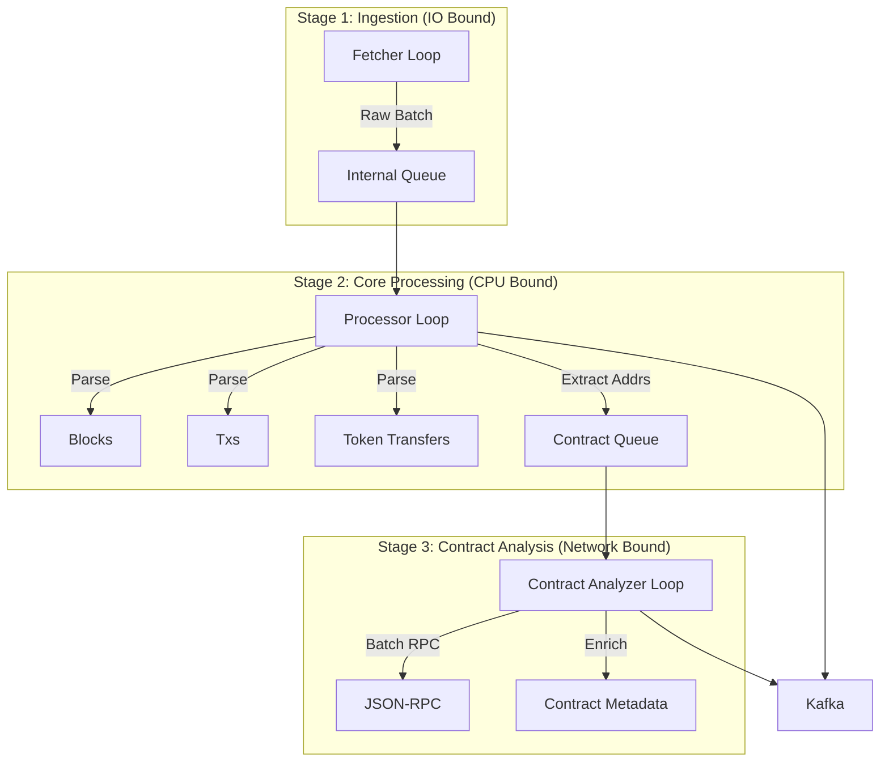

# Kế hoạch Refactor Hệ thống Phát hiện & Phân tích Smart Contract

Tài liệu này phác thảo kế hoạch tái cấu trúc (refactor) module `ingestion/ethereumetl`, tập trung vào việc tối ưu hóa quy trình phát hiện (detection), phân loại (classification), và làm giàu dữ liệu (enrichment) cho Smart Contracts và Token Transfers.

## 1. Mục tiêu & Động lực

Hệ thống hiện tại hoạt động theo mô hình tuần tự và dựa nhiều vào các giả định đơn giản về Token Standard (chủ yếu là ERC20/721). Việc refactor nhằm giải quyết các vấn đề sau:

1.  **Hiệu năng (Performance):** Chuyển từ xử lý tuần tự (Sequential RPC calls) sang xử lý song song (Parallel Pipeline) để giảm thiểu thời gian chờ I/O. Tách biệt luồng xử lý Transaction/Log (cần nhanh) và luồng phân tích Contract (chậm).
2.  **Độ chính xác (Accuracy):** Cải thiện logic phát hiện Contract Type, đặc biệt là các mô hình Proxy phức tạp (EIP-1167, EIP-1967, Diamond) và Token Standard (ERC-1155 Batch Transfers).
3.  **Khả năng mở rộng (Extensibility):** Xây dựng kiến trúc module hóa (Service-oriented), dễ dàng thêm các rule phân loại mới (ví dụ: phát hiện Uniswap Pool, Chainlink Oracle) mà không cần sửa đổi core logic.
4.  **Tương thích Data Warehouse (OLAP Ready):** Chuẩn hóa Schema dữ liệu đầu ra (Avro/Flat Schema) để tối ưu cho việc truy vấn trên ClickHouse/Spark.

## 2. Kiến trúc Đích (Target Architecture)

Hệ thống sẽ chuyển sang mô hình **Asynchronous Pipeline 3 Giai đoạn** trong `IngestionWorker`.

### Điểm nhấn Kiến trúc:
*   **Decoupling:** Việc phân tích Contract (tốn nhiều RPC call: `getCode`, `getStorageAt`, `call`) không được phép làm chậm luồng ingestion Block/Transaction.
*   **Caching:** Sử dụng In-Memory LRU Cache cho kết quả phân tích Contract để tránh gọi RPC lặp lại cho các Hot Contract (USDT, Uniswap Router).
*   **Priority:** Ưu tiên `eth_getCode` để lọc EOA trước khi thực hiện bất kỳ phân tích sâu nào.

## 3. Chi tiết Thay đổi (Action Items)

### 3.1. Data Models (`ingestion/ethereumetl/models/`)

*   **`contract.py`:**
    *   [x] Refactor thành cấu trúc kế thừa: `EthBaseContract` -> `EthImplementationContract`, `EthProxyContract`.
    *   [x] Thêm các Enum: `ImplContractCategory` (TOKEN, NFT, DEX...), `ProxyType` (MINIMAL, BEACON...).
    *   [x] Thêm trường `impl_detected_by` và `impl_classify_confidence` để lưu vết logic phân loại.
*   **`token_transfer.py`:**
    *   [x] Thêm hỗ trợ ERC-1155: `amounts` (list), `erc1155_mode` (SINGLE/BATCH).
    *   [x] Thêm Enum `TokenStandard`, `TransferType` (MINT/BURN).

### 3.2. Avro Schemas (`ingestion/schemas/`)

*   **`contract.avsc`:**
    *   [x] Giữ cấu trúc "Fat Schema" (Flat) để tương thích ClickHouse.
    *   [x] Đổi tên `category` thành `contract_category` (Map từ `impl_category`).
    *   [x] Thêm `impl_detected_by`, `impl_classify_confidence`.
*   **`token_transfer.avsc`:**
    *   [x] Cập nhật cấu trúc nested `amounts` cho batch transfer.
    *   [x] Thêm các trường phân loại mới: `token_standard`, `transfer_type`, `erc1155_mode`, `operator_address`.

### 3.3. Core Logic & Services (`ingestion/ethereumetl/service/`)

#### A. `EthTokenTransfersService` (Log Parsing & Classification)
*   **Mục tiêu:** Parse log, phân loại Standard, và xác định hành vi Mint/Burn.
*   **Best Practices:**
    *   **Early Classification:** Dựa vào `Topic Signature` và `len(topics)` để gán cờ `token_standard` ngay lập tức.
        *   `Transfer` (3 topics) -> **ERC20**.
        *   `Transfer` (4 topics) -> **ERC721**.
        *   `TransferSingle`/`TransferBatch` -> **ERC1155**.
    *   **Mint/Burn Logic:**
        *   `from == 0x0` -> `TransferType.MINT`.
        *   `to == 0x0` -> `TransferType.BURN`.
    *   **Output:** Trả về danh sách `EthTokenTransfer` hoàn chỉnh.

#### B. `EthContractAnalyzerService` (Static Bytecode Analysis)
*   **Mục tiêu:** Phân tích bytecode offline để tìm signature đặc trưng.
*   **Best Practices:**
    *   [x] **Minimal Proxy (EIP-1167):** Tối ưu hóa `is_minimal_proxy` dùng regex/string slicing để check pattern prefix/suffix.
    *   [ ] **Transparent/UUPS:** Quét Function Selectors tìm `upgradeTo(address)` (`0x3659cfe6`) hoặc `upgradeToAndCall`.
    *   [ ] **Diamond:** Quét tìm `diamondCut` (`0x1f931c1c`) và `facets`.
    *   [ ] **Gnosis Safe:** Quét tìm `setup` (`0xa97ab18a`).

#### C. `EthContractService` (The "Brain" - Orchestrator)
*   **Mục tiêu:** Điều phối RPC calls để build model `EthContract` hoàn chỉnh.
*   **Flowchart ("The Waterfall"):**
    1.  **Cache Check:** Kiểm tra `async_lru` cache. Nếu có -> Return.
    2.  **EOA Check:** Gọi `eth_getCode`. Nếu `0x` -> Mark EOA -> Return.
    3.  **Minimal Proxy Check:** Check pattern EIP-1167 trên bytecode.
        *   Nếu True -> `is_proxy=True`, `type=MINIMAL`. Resolve Implementation Address.
    4.  **Static Analysis:** Disassemble bytecode -> `sighashes`.
        *   Check ERC20/721 signatures.
    5.  **Deep Proxy Check:** (Nếu chưa xác định được loại contract)
        *   Check Storage Slots (EIP-1967 Beacon/Impl) bằng `eth_getStorageAt`.
        *   Nếu có Implementation -> `is_proxy=True`, `type=TRANSPARENT/BEACON`.
    6.  **Implementation Resolution (Recursive):**
        *   Nếu là Proxy -> Gọi `eth_getCode(impl_address)`.
        *   Phân tích bytecode của Implementation để xác định `ImplContractCategory` (Token/NFT/DEX...).
        *   Gán ngược Category này về cho Proxy.
    7.  **Metadata Enrichment:**
        *   Nếu Category là TOKEN/NFT -> Gọi `eth_call` (name, symbol, decimals) vào địa chỉ **Proxy**.
        *   Lý do: State (tên, số dư) nằm ở Proxy, Logic nằm ở Impl.

### 3.4. Orchestration (`ingestion/ethereumetl/ingestion_worker.py`)

*   [x] Tách `IngestionWorker` thành 3 vòng lặp `asyncio` (Fetcher, Processor, ContractWorker).
*   **Contract Discovery Strategy:**
    *   `EthDataEnricher` sẽ thu thập Unique Addresses từ:
        *   `receipts.contractAddress` (Contract mới tạo).
        *   `logs.address` (Contract tương tác - Token).
    *   Đẩy danh sách này vào `ContractQueue` để xử lý bất đồng bộ.

## 4. Lộ trình Thực hiện (Execution Plan)

1.  **Phase 1: Foundation (Đã hoàn thành)**
    *   Cập nhật Pydantic Models & Avro Schemas.
    *   Refactor `IngestionWorker` sang mô hình Async Queue.

2.  **Phase 2: Advanced Logic Implementation (Đang thực hiện)**
    *   **Step 2.1:** Refactor `EthTokenTransfersService` để handle đa chuẩn & Mint/Burn.
    *   **Step 2.2:** Nâng cấp `EthContractAnalyzerService` với logic detect Transparent/UUPS/Diamond.
    *   **Step 2.3:** Viết lại `EthContractService` theo Flowchart "Waterfall" ở trên, bao gồm logic đệ quy cho Implementation.

3.  **Phase 3: Optimization & Caching**
    *   Tích hợp thư viện `async-lru` vào `EthContractService`.
    *   Cấu hình TTL và MaxSize cho Cache dựa trên profile bộ nhớ của Worker.

4.  **Phase 4: Integration & Testing**
    *   Chạy `stream_ethereum` ở chế độ debug (console output).
    *   Verify dữ liệu đầu ra với các contract mẫu (ERC20, NFT, Proxy).
    *   Verify khả năng chịu tải (Backpressure) của `ContractQueue`.

## 5. Tài liệu Tham khảo & Constants

*   **Constants:** `constants/constants.py` và `constants/event_transfer_signature.py` chứa toàn bộ Signature và Magic Bytes cần thiết.
*   **Logic Tham chiếu:** Xem chi tiết tại `docs/contract_address_detection_report.md`.